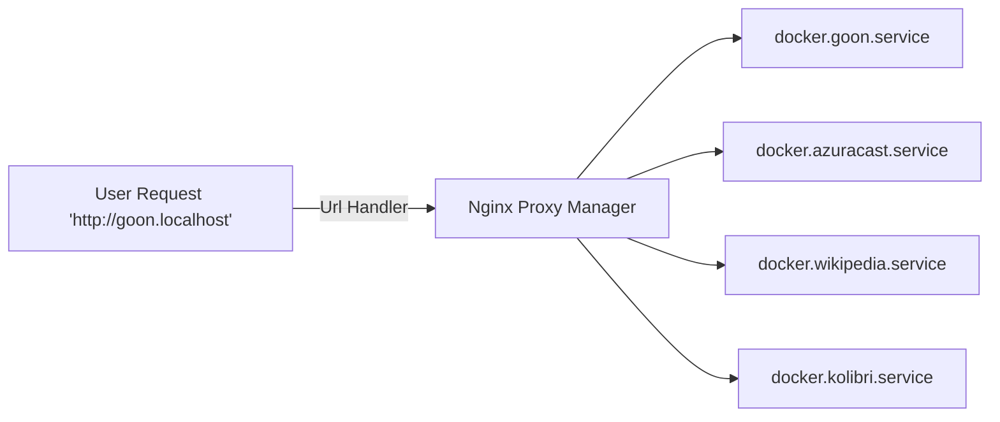

# Welcome to GOON!

<p align="center">
</p>

Hi! Thank you for joinging GOON Community.

The starting place to build GOON on your own server and join our GOON Community

An open-source platform designed to bridge the digital divide between rural and urban communities in Cameroon by providing offline digital services to community members.

# Community

join our community and fill free to contribute to our open-source solution
our discord :

Join our `Discord Channel` [join](https://discord.gg/vNNsKGZN).

# Getting Started

### Requirements

You need to install `docker` and `docker-compose` [install](https://docs.docker.com/engine/install/ "https://docs.docker.com/engine/install/") in order to start the API server.

### Installing the project

Clone this repository.

```bash

git clone https://github.com/SepCy/GOON-v.2.git

```

Start by the backend first

### Open the backend service.

```bash
cd backend
```

follow the step define in the Readme, when all the container are running and the proxy hosts are sets, move to the frontend folder.

### move to the frontend folder.

```bash
cd frontend
```

follow the step define in the Readme, make sure to modify the .env file to add all hosts.
If not, the npm run build command will not show errors of gathing data.

### Open the browser

Open one of your browser to :

```bash

http://localhost:3002

```

or the hosts you provide in the Nginx proxy manager.

### Basic architecture


