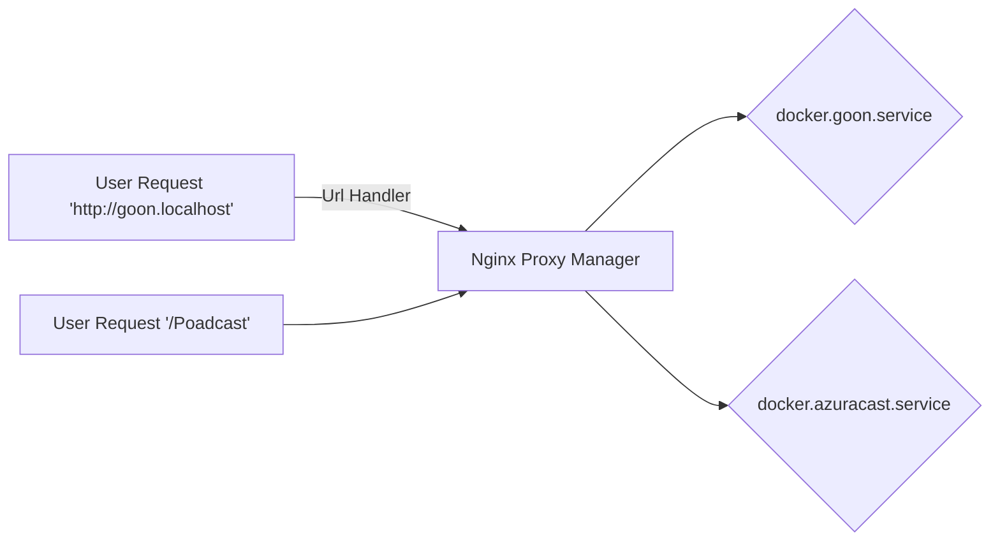

# Welcome to GOON!

<p align="center">
</p>

An open-source platform designed to bridge the digital divide between rural and urban communities in Cameroon by providing offline digital services to community members.

# Getting Started

### Requirements

> **<i>Important </i> : Before you run these services, make sure to have docker and docker-compose enable and running in your computer**.

### Navigate into the project folder

You need first to open the **Nginx folder**
this service is the starting point for our application, doing the reverse proxy for any request comming from the user side.
Here is an example :



Create the network before running the containers

```bash
docker network  create  web  internal
```

Open the Nginx proxy folder

```bash
cd nginx
```

run the docker-compose up command to start the container

```bash
docker-compose up -d
```

And then open your browser to : http://localhost:81/
default credential for login in are :

> email address: admin@example.com </br>
> password: changeme

Then you can change the default credential to insert your own.
Next, you need to specify the proxy hosts for wanted to use as defined below.
After these step, you can start other services.
Open the api folder for the wodpress service

```bash
cd api
```

run the docker-compose up command to start the container

```bash
docker-compose up -d
```

And go to Nginx proxy manger to add the proxy hosts for the api service.
**And move to the next service by repeating the same step.**

- goon.tcp --> 3002
- api.goon.tcp --> 9080
- kolibri.goon.tcp --> 3001
- wikipedia.goon.tcp --> 3003
- poadcast.goon.tcp --> 8009
- coding.goon.tcp --> 3006
- ludo.goon.tcp --> ?
- message.goon.tcp --> 3000

## Services

run the docker ps command know the port used by a service and add it to the proxy hosts of nginx proxy manager

```bash
docker ps
```

Here are some service in our repository

- Elearning Wikipedia Module | Wikipedia and Kolibri
- Blog Module | Wordpress
- Survey API Module | Survey forms for needs analysis and evaluation across different projects.
- Chat Module | Where users should be able to exchange texts, voice messages, pdf files, audio files, and images. |
- Game Module | Ludo is a strategy board game for two to four players, in which the players race their four tokens from start to finish according to the rolls of a single die.
- Coding Module | Scratch is a high-level block-based visual programming language and website aimed primarily at children as an educational tool for programming, with a target audience of ages 8 to 16.
- Poadcast Module | AzuraCast is a free and open-source, self-hosted web radio management suite.

### Help & Support

For any help and support, fill free to ask, share and get help from our developers and communities `Discord Channel` [join](https://discord.gg/vNNsKGZN)
